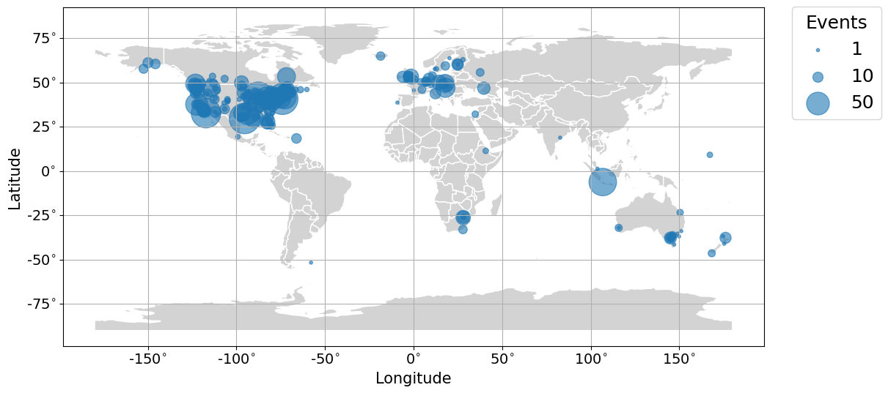
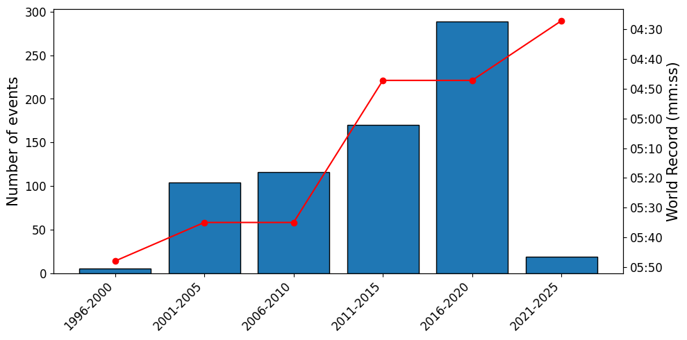

# Beer Mile Statistical Analysis

The beer mile is a one-mile run (four laps of a standard 400-meter track) where competitors must drink a 12 oz beer (>5% ABV) before each lap. What began as a quirky college challenge has grown into an internationally contested event, with the current world record held by Corey Bellemore of Canada, who ran it in 4:27.1 (July 2025). While participation is voluntary and not without risks, the event combines speed running with alcohol consumption, creating a unique "dual-stress" challenge. The figure below shows the global reach of the event, primarily organized in North America, Europe, and Australia. Many countries and people around the world do not to partake in the event due to religious, health, or personal reasons.

The future of the beer mile will likely continue along the trajectory shown below, where participation grows steadily but performance gains slow. The temporary dip between 2021 and 2025 was almost certainly influenced by disruptions from the COVID-19 pandemic. Although the world record may continue to improve, it will almost certainly never reflect the true physiological limits of elite running. The top runners remain fully committed to the Olympics and World Championships, where the stakes, visibility, and financial opportunities are incomparable to the beer mile. Because of this, they have little incentive to risk their training cycles by competing in a still-novel event. As a result, future world records will be pushed primarily by dedicated specialists and strong sub-elites.

